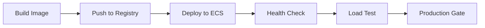

# NGX Voice Sales Agent - CI/CD Pipeline Documentation

## 🚀 Overview

This repository implements a comprehensive CI/CD pipeline for the NGX Voice Sales Agent, a FastAPI-based conversational AI service with ML capabilities. The pipeline ensures code quality, security, and reliable deployments across multiple environments.

## 📋 Pipeline Architecture

### Continuous Integration (CI)
- **Trigger**: Pull requests and pushes to `main`/`develop`
- **Duration**: ~15-20 minutes
- **Parallelization**: Up to 6 jobs running simultaneously

### Continuous Deployment (CD)
- **Trigger**: Pushes to `main` branch (after CI passes)
- **Staging**: Automatic deployment
- **Production**: Manual approval required

### Daily Monitoring
- **Trigger**: Scheduled daily at 2:00 AM UTC
- **Scope**: Security, performance, and dependency health checks

## 🔄 Workflow Details

### 1. Continuous Integration (`ci.yml`)

#### Security Scanning
- **Dependency vulnerabilities**: Safety, pip-audit, OSV Scanner
- **Code security**: Bandit (SAST), Semgrep rules
- **Threshold**: Fails on high-severity issues

#### Code Quality
- **Formatting**: Black, isort
- **Linting**: flake8, pylint
- **Type checking**: mypy
- **Coverage requirement**: 80%+ (currently at 87%)

#### Testing Strategy
```yaml
Test Matrix:
├── Unit Tests (tests/unit/)
├── Integration Tests (tests/integration/, tests/capabilities/)
├── Security Tests (tests/security/)
└── Load Tests (Smoke test: 10 users, 30s)
```

#### Build Validation
- **Docker build**: Multi-platform (amd64, arm64)
- **Container testing**: Health checks and basic API validation
- **Image optimization**: Build cache and layer optimization

### 2. Continuous Deployment (`cd.yml`)

#### Staging Deployment


- **Infrastructure**: AWS ECS with rolling deployment
- **Testing**: Full load test (100 users, 5 minutes)
- **Rollback**: Automatic on health check failure

#### Production Deployment
- **Protection**: Manual approval required
- **Strategy**: Blue-green deployment with health monitoring
- **Verification**: 15-minute post-deployment monitoring
- **Rollback**: Available via manual workflow

### 3. Daily Checks (`daily-checks.yml`)

#### Security Monitoring
- **Vulnerability scanning**: New CVEs in dependencies
- **Security posture**: Code security analysis
- **Compliance**: Security configuration validation

#### Performance Monitoring
- **Baseline testing**: Performance regression detection
- **Memory analysis**: Resource usage monitoring
- **Historical tracking**: 30-day performance history

#### Alerting
- **GitHub Issues**: Auto-created for failures
- **Slack notifications**: Critical alerts (if configured)
- **Email**: Via GitHub notifications

## 🛠️ Manual Operations

### Manual Deployment (`manual-deploy.yml`)
```bash
# Deploy specific version to staging
gh workflow run manual-deploy.yml \
  -f environment=staging \
  -f image_tag=v1.2.3

# Emergency production rollback
gh workflow run manual-deploy.yml \
  -f environment=production \
  -f rollback=true
```

### Repository Cleanup (`cleanup.yml`)
- **Artifacts**: Removes artifacts >30 days old
- **Images**: Cleans untagged and old container images
- **Cache**: Optimizes GitHub Actions cache
- **Schedule**: Weekly on Sundays

## 🔐 Security Implementation

### Secrets Management
All sensitive data is stored in GitHub Secrets:

```yaml
Repository Secrets:
├── OPENAI_API_KEY_TEST         # AI testing
├── SUPABASE_URL_TEST          # Database testing
├── SUPABASE_ANON_KEY_TEST     # Database testing
└── SLACK_WEBHOOK_URL          # Notifications (optional)

Environment Secrets (per env):
├── AWS_ACCESS_KEY_ID_*        # Deployment credentials
├── AWS_SECRET_ACCESS_KEY_*    # Deployment credentials
├── STAGING_API_TOKEN          # API verification
└── PRODUCTION_API_TOKEN       # API verification
```

### Environment Protection
- **Staging**: No restrictions (rapid iteration)
- **Production**: 
  - Required reviewers (2+ recommended)
  - Branch restrictions (main only)
  - Manual approval gates

### Security Scanning
- **SAST**: Bandit, Semgrep
- **Dependency**: Safety, pip-audit, OSV
- **Container**: Trivy scanning (optional)
- **Secrets**: GitHub secret scanning enabled

## 📊 Monitoring & Observability

### Pipeline Metrics
- **Success rate**: Target >95%
- **Build time**: Target <20 minutes
- **Deployment time**: Target <10 minutes
- **Test coverage**: Maintain >80%

### Application Metrics
- **Response time**: <2s average
- **Error rate**: <1% failure rate
- **Availability**: >99.9% uptime
- **Load capacity**: 100+ concurrent users

### Alerting Levels
1. **Info**: Successful deployments, daily reports
2. **Warning**: Test failures, performance degradation
3. **Critical**: Security issues, deployment failures
4. **Emergency**: Production outages, data breaches

## 🚀 Deployment Environments

### Development
- **Branch**: `develop`
- **Database**: Shared dev instance
- **Features**: All experimental features enabled
- **Testing**: Basic smoke tests

### Staging
- **Branch**: `main`
- **Database**: Production-like replica
- **Features**: Production feature set
- **Testing**: Full test suite + load testing
- **URL**: `https://staging.ngx-voice-agent.com`

### Production
- **Branch**: `main` (manual approval)
- **Database**: Production instance
- **Features**: Stable feature set only
- **Testing**: Health checks + monitoring
- **URL**: `https://api.ngx-voice-agent.com`

## 📝 Best Practices

### Code Quality
```yaml
Requirements:
├── Black formatting (line length: 100)
├── Import sorting with isort
├── Type hints for all functions
├── Comprehensive docstrings
├── Unit test coverage >80%
└── Integration test coverage >60%
```

### Commit Standards
- **Format**: Conventional Commits (`feat:`, `fix:`, `docs:`, etc.)
- **Size**: Atomic commits (single logical change)
- **Testing**: All tests must pass before merge
- **Review**: All PRs require approval

### Deployment Safety
1. **Feature flags**: For gradual rollouts
2. **Health checks**: Multi-layer validation
3. **Rollback plans**: Always available
4. **Monitoring**: Real-time alerts
5. **Blue-green**: Zero-downtime deployments

## 🔧 Troubleshooting

### Common Issues

#### CI Pipeline Failures
```bash
# Check test failures
gh run list --workflow=ci.yml --limit=5
gh run view [run-id] --log

# Re-run failed jobs
gh run rerun [run-id] --failed
```

#### Deployment Issues
```bash
# Check deployment status
aws ecs describe-services --cluster ngx-production --services ngx-voice-agent-production

# View service logs
aws logs tail /ecs/ngx-voice-agent --follow
```

#### Secret Issues
```bash
# Verify secrets are set
gh secret list

# Test secret access
gh workflow run manual-deploy.yml -f environment=staging
```

### Emergency Procedures

#### Production Rollback
1. Navigate to Actions → Manual Deployment
2. Select `production` environment
3. Check `rollback=true`
4. Approve and monitor

#### Critical Security Issue
1. Immediately revoke affected secrets
2. Deploy security fix to staging
3. Run full security scan
4. Deploy to production with expedited approval

#### Performance Degradation
1. Check monitoring dashboards
2. Scale ECS service if needed
3. Investigate root cause
4. Deploy performance fix

## 📈 Continuous Improvement

### Metrics Collection
- Pipeline performance data
- Test execution times
- Deployment success rates
- Security scan results

### Regular Reviews
- **Weekly**: Pipeline performance review
- **Monthly**: Security posture assessment
- **Quarterly**: Architecture and tool evaluation
- **Annually**: Complete pipeline audit

### Future Enhancements
- [ ] Chaos engineering tests
- [ ] Performance regression testing
- [ ] Multi-region deployments
- [ ] Advanced canary deployments
- [ ] ML model deployment pipeline

## 📞 Support

### Team Contacts
- **DevOps Team**: `@devops` in Slack
- **Security Team**: `@security` in Slack
- **On-call Engineer**: Check PagerDuty rotation

### Documentation
- [Secrets Setup Guide](.github/SECRETS_SETUP.md)
- [AWS Infrastructure](../docs/DOCKER_DEPLOYMENT.md)
- [Monitoring Setup](../docs/MONITORING_SETUP.md)
- [Security Guidelines](../SECURITY.md)

### Issue Escalation
1. **Level 1**: Create GitHub issue with `ci-cd` label
2. **Level 2**: Slack `#engineering` channel
3. **Level 3**: Page on-call engineer
4. **Level 4**: Escalate to engineering manager

---

*Documentation version: 1.0*  
*Last updated: 2025-08-03*  
*Next review: 2025-09-03*