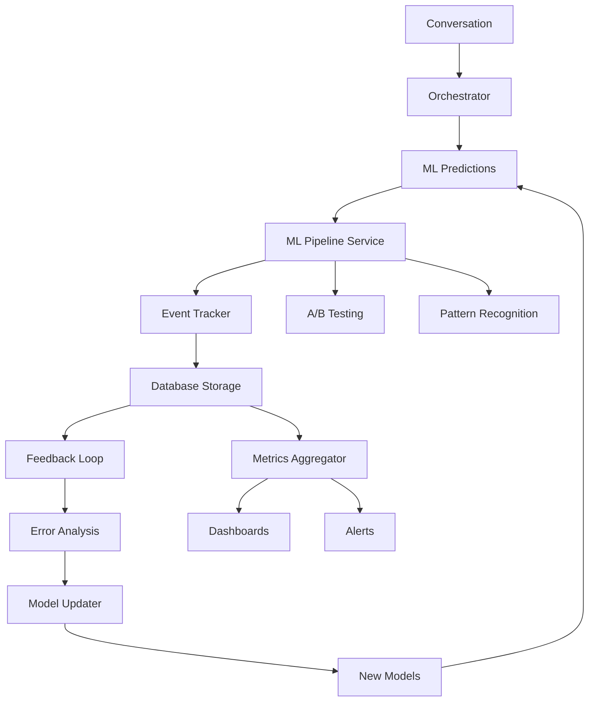

# ML Pipeline Architecture for NGX Voice Sales Agent

## Overview

The ML Pipeline is a comprehensive system that enables continuous learning and improvement of the NGX Voice Sales Agent through real-time data capture, analysis, and model updates.

## Architecture Components

### 1. ML Pipeline Service (Core Orchestrator)
```
src/services/ml_pipeline/ml_pipeline_service.py
```
- Central coordinator for all ML operations
- Manages prediction capture and storage
- Integrates A/B testing framework
- Handles pattern recognition
- Coordinates model updates

### 2. ML Event Tracker
```
src/services/ml_pipeline/ml_event_tracker.py
```
- Records all ML-related events
- Monitors model performance
- Detects drift in real-time
- Provides event streaming capabilities

### 3. ML Feedback Loop
```
src/services/ml_pipeline/ml_feedback_loop.py
```
- Compares predictions with actual outcomes
- Identifies prediction errors
- Generates improvement suggestions
- Queues model retraining tasks

### 4. ML Metrics Aggregator
```
src/services/ml_pipeline/ml_metrics_aggregator.py
```
- Real-time metric aggregation
- Performance monitoring
- Trend analysis
- Alert generation

### 5. ML Model Updater
```
src/services/ml_pipeline/ml_model_updater.py
```
- Automated model retraining
- Version management
- Safe deployment with rollback
- Performance validation

## Data Flow



## Database Schema

### ml_tracking_events
```sql
CREATE TABLE ml_tracking_events (
    id UUID PRIMARY KEY,
    conversation_id UUID,
    event_type VARCHAR(50),
    event_category VARCHAR(50),
    timestamp TIMESTAMP,
    data JSONB,
    created_at TIMESTAMP DEFAULT NOW()
);
```

### ml_experiments
```sql
CREATE TABLE ml_experiments (
    id UUID PRIMARY KEY,
    name VARCHAR(255),
    experiment_type VARCHAR(50),
    status VARCHAR(50),
    config JSONB,
    metrics JSONB,
    results JSONB,
    created_at TIMESTAMP DEFAULT NOW(),
    completed_at TIMESTAMP
);
```

### pattern_recognitions
```sql
CREATE TABLE pattern_recognitions (
    id UUID PRIMARY KEY,
    pattern_type VARCHAR(100),
    pattern_data JSONB,
    confidence FLOAT,
    occurrences INTEGER,
    first_seen TIMESTAMP,
    last_seen TIMESTAMP,
    created_at TIMESTAMP DEFAULT NOW()
);
```

## Integration with Orchestrator

### 1. Prediction Capture
```python
# In orchestrator after making predictions
enhanced_predictions = await self.ml_pipeline.process_orchestrator_predictions(
    conversation_id=state.conversation_id,
    messages=state.messages,
    context={
        "phase": state.phase,
        "customer_data": state.customer_data,
        "program_type": state.program_type
    },
    existing_predictions=predictions
)
```

### 2. Outcome Recording
```python
# When conversation ends
await self.ml_pipeline.record_conversation_outcome(
    conversation_id=conversation_id,
    outcome=outcome,
    metrics={
        "predictions": predictions,
        "duration_seconds": duration,
        "message_count": len(messages),
        "ab_variants": ab_variants
    }
)
```

## A/B Testing Integration

### Multi-Armed Bandit Algorithm
- Dynamic variant selection based on performance
- Real-time optimization
- Automatic winner deployment

### Example Experiments
1. **Greeting Variations**
   - Test different greeting styles
   - Measure engagement rates
   
2. **Objection Handling**
   - Test response strategies
   - Track resolution rates
   
3. **Closing Techniques**
   - Compare urgency levels
   - Monitor conversion rates

## Pattern Recognition

### Real-time Patterns Detected
1. **Conversation Flow Patterns**
   - Common objection sequences
   - Successful conversion paths
   - Drop-off points

2. **Customer Behavior Patterns**
   - Response timing
   - Engagement indicators
   - Interest signals

3. **Performance Patterns**
   - Time-of-day effects
   - Platform-specific behaviors
   - Demographic correlations

## Feedback Loop Process

### 1. Continuous Learning Cycle
```
Prediction → Outcome → Analysis → Improvement → Retraining → Deployment
```

### 2. Error Analysis
- **Objection Misses**: When actual objections weren't predicted
- **Need Misidentification**: Incorrect customer need detection
- **Conversion Errors**: Wrong conversion probability predictions

### 3. Improvement Generation
- Automatic identification of model weaknesses
- Prioritized improvement suggestions
- Targeted retraining recommendations

## Model Update Pipeline

### 1. Update Triggers
- Scheduled updates (daily/weekly)
- Performance degradation detection
- Drift alerts
- Manual triggers

### 2. Update Process
1. **Data Collection**: Gather recent conversation data
2. **Preprocessing**: Clean and prepare training data
3. **Training**: Train new model version
4. **Validation**: Compare with current model
5. **Deployment**: Deploy if improvement > threshold
6. **Monitoring**: Track post-deployment performance

### 3. Rollback Capability
- Automatic performance monitoring
- Quick rollback if issues detected
- Version history maintenance

## Metrics and Monitoring

### Key Performance Indicators
1. **Model Accuracy**
   - Objection prediction accuracy
   - Needs detection precision
   - Conversion prediction accuracy

2. **Pipeline Health**
   - Prediction latency
   - Processing throughput
   - Error rates

3. **Business Impact**
   - Conversion rate improvement
   - Customer satisfaction scores
   - Revenue impact

### Real-time Dashboards
- Model performance trends
- A/B test results
- Pattern insights
- Alert status

## Implementation Guide

### 1. Initialize ML Pipeline
```python
from src.services.ml_pipeline import MLPipelineService

# Initialize pipeline
ml_pipeline = MLPipelineService()

# Get pipeline status
metrics = await ml_pipeline.get_ml_pipeline_metrics()
```

### 2. Process Predictions
```python
# During conversation
result = await ml_pipeline.process_conversation_predictions(
    conversation_id="conv-123",
    messages=messages,
    context=context,
    predictions=predictions
)

# Access enhanced predictions
enhanced_predictions = result["predictions"]
ab_variants = result["ab_variants"]
```

### 3. Record Outcomes
```python
# After conversation
await ml_pipeline.record_conversation_outcome(
    conversation_id="conv-123",
    outcome="completed",
    metrics={
        "conversion_value": 2700,
        "tier_selected": "STARTER"
    }
)
```

### 4. Get Insights
```python
# Pattern insights
patterns = await ml_pipeline.get_pattern_insights(
    timeframe_hours=24
)

# Model performance
metrics = await ml_pipeline.metrics_aggregator.get_model_comparison_metrics(
    model_types=["objection", "needs", "conversion"],
    timeframe_hours=168
)
```

## Best Practices

### 1. Data Quality
- Ensure accurate outcome labeling
- Maintain consistent data formats
- Regular data validation

### 2. Model Management
- Regular performance reviews
- Gradual rollouts for major changes
- Maintain model documentation

### 3. Monitoring
- Set up comprehensive alerts
- Regular health checks
- Performance benchmarking

### 4. Privacy and Security
- Anonymize sensitive data
- Secure model storage
- Access control for updates

## Future Enhancements

### 1. Advanced ML Capabilities
- Deep learning models
- Transformer-based predictions
- Multi-modal analysis

### 2. Enhanced Personalization
- Customer-specific models
- Dynamic adaptation
- Context-aware predictions

### 3. Expanded Integration
- External data sources
- Cross-platform learning
- Federated learning

## Troubleshooting

### Common Issues

1. **High Prediction Latency**
   - Check model complexity
   - Optimize inference pipeline
   - Consider caching

2. **Drift Detection Alerts**
   - Review recent data changes
   - Check for seasonal patterns
   - Validate data quality

3. **Low Model Accuracy**
   - Increase training data
   - Review feature engineering
   - Check for data leakage

### Debug Commands
```python
# Check pipeline health
health = await ml_pipeline.get_ml_pipeline_metrics()

# View recent errors
errors = await ml_pipeline.event_tracker.get_event_stream(
    event_types=["error"],
    limit=50
)

# Get drift alerts
alerts = await ml_pipeline.event_tracker.get_drift_alerts(
    timeframe_hours=24
)
```

## Contact and Support

For ML Pipeline issues or questions:
- Technical Lead: AI/ML Team
- Documentation: This file
- Monitoring Dashboard: [ML Pipeline Dashboard]
- Alerts Channel: #ml-pipeline-alerts